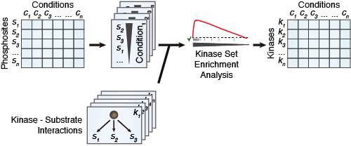
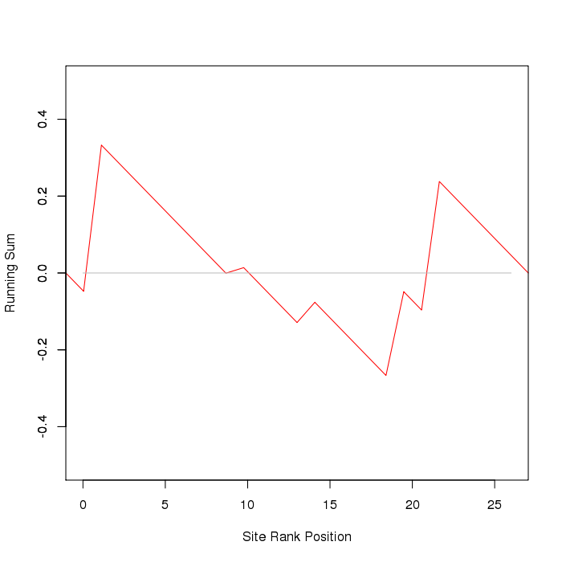

### Introduction

This package contains an implementation of the Kinase Set Enrichment Analysis (KSEA) used to predict kinase activities based on quantitative phosphoproteomic studies. Using a quantitative phosphoproteomic profile and a list of known targets, the algorithms predicts the activity of the based on the enrichment on top regulated sites within the known targets of the kinase.



###Installation

The `ksea` package can be installed directly from github (if public) or locally using the devtools package.


```r
install.packages('devtools')
```

#####Github installation


```r
require(devtools)
install_github("dogcaesar/ksea")
```

#####Local installation

You can clone this project and install it locally in your computer.


```r
require(devtools)
install("./ksea")
```

###Usage

First load the `ksea` package.


```r
library("ksea")
```

Next create some fake data. In one hand, we create a list named `regulons` containing a vector per kinase with the names of the known substrates. Secondly, we create a vector sites with quantifications for the sites going from A to Z. Finally, we sort the quantifications.


```r
regulons <- list(kinaseA=sample(LETTERS, 5))
regulons
```

```
## $kinaseA
## [1] "H" "Z" "X" "Q" "J"
```

```r
sites <- rnorm(length(LETTERS))
names(sites) <- LETTERS
sites <- sites[order(sites, decreasing=TRUE)]
sites
```

```
##           U           J           B           D           M           K 
##  1.28203017  1.18290895  1.00870386  0.98361550  0.70789790  0.66667179 
##           C           Y           L           H           S           O 
##  0.49480823  0.28026819  0.11902448  0.04488696  0.03669630 -0.05799009 
##           G           Q           T           I           F           R 
## -0.16370132 -0.16386796 -0.32232170 -0.34002203 -0.48457569 -0.49747583 
##           Z           V           X           N           E           A 
## -0.67767522 -0.92382567 -1.04033437 -1.09656516 -1.19541815 -1.79541209 
##           P           W 
## -2.49714732 -2.58409146
```

The function `ksea` will run the enrichment analysis for the provided quantifications and known kinase targets.


```r
ksea_result <- ksea(names(sites), sites, regulons[["kinaseA"]], trial=1000, significance = TRUE)
```

 

```r
ksea_result
```

```
## $ES
##         J 
## 0.3327775 
## 
## $p.value
##     J 
## 0.275
```

The function `ksea_batchKinases` calculates the KSEA p-value for a list of kinases. To improve the performance of the function, it uses as many cores as possible using the `parallell` package.


```r
regulons[["kinaseB"]] <- sample(LETTERS, 3)
regulons[["kinaseC"]] <- sample(LETTERS, 7)
regulons
```

```
## $kinaseA
## [1] "H" "Z" "X" "Q" "J"
## 
## $kinaseB
## [1] "C" "I" "Z"
## 
## $kinaseC
## [1] "H" "B" "I" "W" "X" "Z" "C"
```

```r
kinases_ksea <- ksea_batchKinases(names(sites), sites, regulons, trial=1000)
```

```
## Loading required package: parallel
```

```r
kinases_ksea
```

```
## kinaseA.J kinaseB.Z kinaseC.R 
##     0.291     0.424     0.470
```


### Developers

The package is documented using [roxygen2](http://cran.r-project.org/web/packages/roxygen2/index.html). After changing the code located in the `R/` folder remember to run 'make' on the main directory to create the documentation following the roxygen2 rules.

To work on the code you will need the `devtools` package installed (read above to installation guide).
