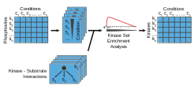

### Introduction

This package contains an implementation of the Kinase Set Enrichment Analysis (KSEA) used to predict kinase activities based on quantitative phosphoproteomic studies. Using a quantitative phosphoproteomic profile and a list of known targets, the algorithms predicts the activity of the based on the enrichment on top regulated sites within the known targets of the kinase.



###Installation

The `ksea` package can be installed directly from github (if public) or locally using the devtools package.


```r
install.packages('devtools')
```

#####Github installation


```r
require(devtools)
install_github("dogcaesar/ksea")
```

#####Local installation

You can clone this project and install it locally in your computer.


```r
require(devtools)
install("./ksea")
```

###Usage

First load the `ksea` package.


```r
library("ksea")
```

Next create some fake data. In one hand, we create a list named `regulons` containing a vector per kinase with the names of the known substrates. Secondly, we create a vector sites with quantifications for the sites going from A to Z.


```r
regulons <- list(kinaseA=sample(LETTERS, 5))
regulons
```

```
## $kinaseA
## [1] "T" "Q" "J" "C" "B"
```

```r
sites <- rnorm(length(LETTERS))
names(sites) <- LETTERS
sites
```

```
##           A           B           C           D           E           F 
## -0.39589312 -1.01313509  1.59145962 -1.75326336 -0.23962032 -0.00219886 
##           G           H           I           J           K           L 
##  0.88437513  0.48515989  2.22793272 -0.62156450  0.59940577 -0.10587234 
##           M           N           O           P           Q           R 
##  1.02308730  0.71575798  1.23355793  0.60003866  1.10594946 -0.60484523 
##           S           T           U           V           W           X 
##  0.92983314 -0.46855419  1.26945365  0.27012527 -1.71571818 -1.02864832 
##           Y           Z 
##  0.17317110 -1.73942208
```

The function `ksea` will run the enrichment analysis for the provided quantifications and known kinase targets.


```r
ksea_result <- ksea(names(sites), sites, regulons[["kinaseA"]], trial=1000, significance = TRUE)
```

 

```r
ksea_result
```

```
## $ES
##         C 
## 0.4949299 
## 
## $p.value
##     C 
## 0.146
```

The function `ksea_batchKinases` calculates the KSEA p-value for a list of kinases. To improve the performance of the function, it uses as many cores as possible using the `parallell` package.


```r
regulons[["kinaseB"]] <- sample(LETTERS, 3)
regulons[["kinaseC"]] <- sample(LETTERS, 7)
regulons
```

```
## $kinaseA
## [1] "T" "Q" "J" "C" "B"
## 
## $kinaseB
## [1] "K" "N" "G"
## 
## $kinaseC
## [1] "I" "V" "K" "U" "N" "L" "J"
```

```r
kinases_ksea <- ksea_batchKinases(names(sites), sites, regulons, trial=1000)
```

```
## Loading required package: parallel
```

```r
kinases_ksea
```

```
## kinaseA.C kinaseB.N kinaseC.H 
##     0.149     0.215     0.190
```


### Developers

The package is documented using [roxygen2](http://cran.r-project.org/web/packages/roxygen2/index.html). After changing the code located in the `R/` folder remember to run 'make' on the main directory to create the documentation following the roxygen2 rules.

To work on the code you will need the `devtools` package installed (read above to installation guide).
