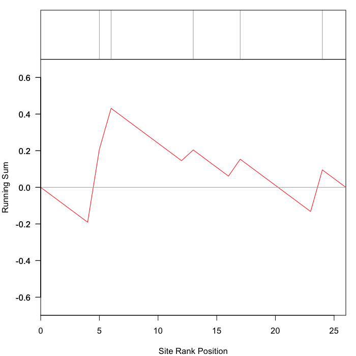

### Introduction

This package contains an implementation of the Kinase Set Enrichment Analysis (KSEA) used to predict kinase activities based on quantitative phosphoproteomic studies. Using a quantitative phosphoproteomic profile and a list of known targets, the algorithms predicts the activity of the based on the enrichment on top regulated sites within the known targets of the kinase.


###Installation

The `ksea` package can be installed directly from github (if public) or locally using the devtools package.


```r
install.packages('devtools')
```

#####Github installation


```r
require(devtools)
install_github("dogcaesar/ksea")
```

#####Local installation

You can clone this project and install it locally in your computer.


```r
require(devtools)
install("./ksea")
```

###Usage

First load the `ksea` package.


```r
library("ksea")
```

Next create some fake data. In one hand, we create a list named `regulons` containing a vector per kinase with the names of the known substrates. Secondly, we create a vector sites with quantifications for the sites going from A to Z. Finally, we sort the quantifications.


```r
regulons <- list(kinaseA=sample(LETTERS, 5))
regulons
```

```
## $kinaseA
## [1] "V" "C" "P" "Q" "R"
```

```r
sites <- rnorm(length(LETTERS))
names(sites) <- LETTERS
sites <- sites[order(sites, decreasing=TRUE)]
sites
```

```
##           D           B           E           P           N           I 
##  2.03762019  1.55461349  1.35110315  1.25799760  1.01558597  0.77266658 
##           S           V           Y           X           O           Q 
##  0.77254893  0.64389834  0.49360369  0.41536958 -0.03120861 -0.21144255 
##           T           Z           G           F           A           H 
## -0.25373787 -0.31140725 -0.37278886 -0.40731507 -0.64643020 -0.65889236 
##           C           W           J           K           U           M 
## -0.67268352 -0.79595344 -0.92648071 -0.95560765 -1.05897401 -1.17062891 
##           L           R 
## -1.38702370 -2.23447948
```

The function `ksea` will run the enrichment analysis for the provided quantifications and known kinase targets.


```r
ksea_result <- ksea(names(sites), sites, regulons[["kinaseA"]], trial=1000, significance = TRUE)
```

 

```r
ksea_result
```

```
## $ES
##         L 
## -0.445071 
## 
## $p.value
##     L 
## 0.253
```

The function `ksea_batchKinases` calculates the KSEA p-value for a list of kinases. To improve the performance of the function, it uses as many cores as possible using the `parallell` package.


```r
regulons[["kinaseB"]] <- sample(LETTERS, 3)
regulons[["kinaseC"]] <- sample(LETTERS, 7)
regulons
```

```
## $kinaseA
## [1] "V" "C" "P" "Q" "R"
## 
## $kinaseB
## [1] "B" "J" "M"
## 
## $kinaseC
## [1] "Y" "L" "R" "Z" "E" "B" "J"
```

```r
kinases_ksea <- ksea_batchKinases(names(sites), sites, regulons, trial=1000)
```

```
## Loading required package: parallel
```

```r
kinases_ksea
```

```
## kinaseA.L kinaseB.W kinaseC.M 
##     0.262     0.392     0.223
```

##### KSEA in parallel #####

Some functions such as `ksea_batchkinases` are optimized to run in parallel in multicore processors. By default they run in 2 cores (if available) but this number can be increased by changing the "mc.cores" variable.


```r
options("mc.cores" = 4)
```

If you are working with an LSF cluster, you can also take the number of cores allocated in the `bsub` command from the `LSB_MCPU_HOSTS` environment variable.


```r
## Setup multicore forking for mclapply based in bsub available cores
hosts <- Sys.getenv("LSB_MCPU_HOSTS")
if(length(hosts) >0){
ncores <- unlist(strsplit(hosts," "))[2]
}else{
ncores <- 1
}
options("mc.cores" = ncores)
```


### Developers

The package is documented using [roxygen2](http://cran.r-project.org/web/packages/roxygen2/index.html). After changing the code located in the `R/` folder remember to run 'make' on the main directory to create the documentation following the roxygen2 rules.

To work on the code you will need the `devtools` package installed (installation guide above).
